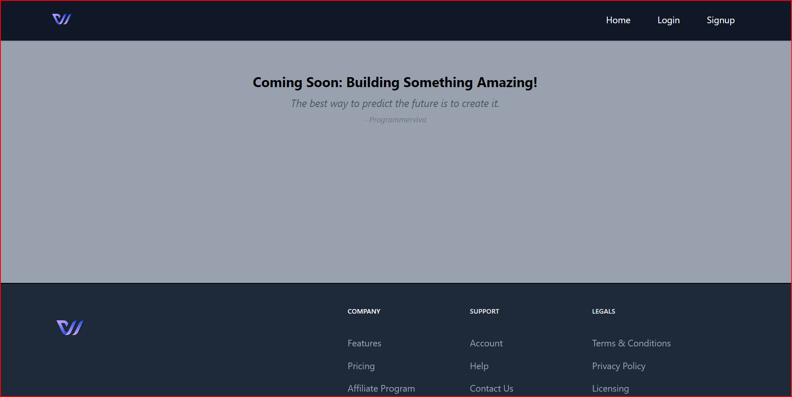
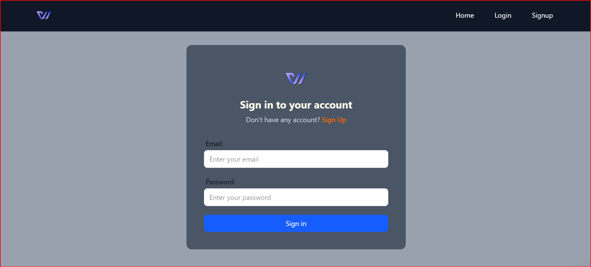
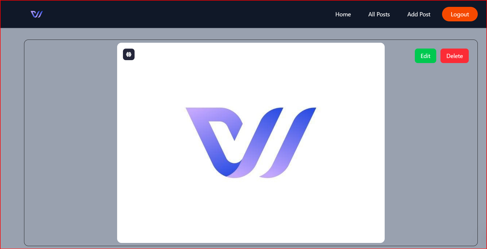
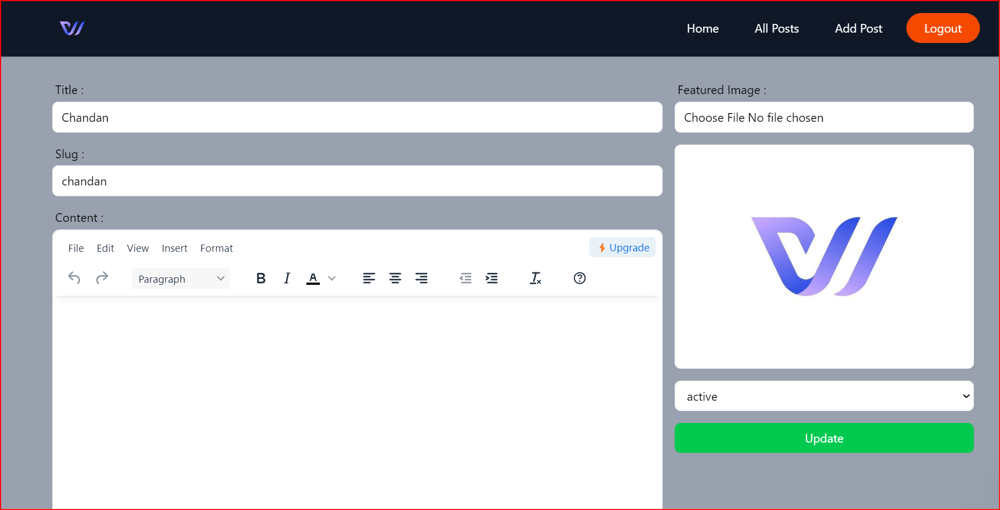

# Install Dependencies

```javascript
// npm create vite@latest
// npm install
// npm i @reduxjs/toolkit react-redux react-router-dom appwrite @tinymce/tinymce-react html-react-parser react-hook-form
```

## Tailwindcss install and setup 

``` javascript
go to tailwindcss official site
```










